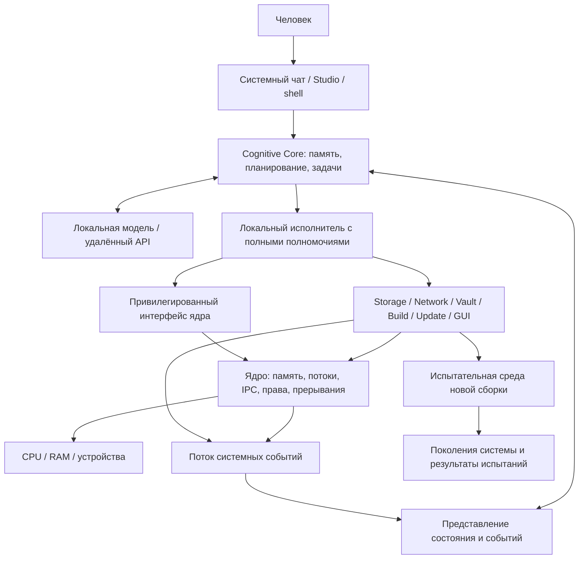

# NANOX-OS: архитектура и программа реализации

Дата: 22 сентября 2026 года.

Статус: предлагаемая архитектура по результатам чтения всей предоставленной беседы. Это исходная проектная записка, а не описание уже реализованной системы. На момент подготовки рабочее дерево содержит только каталог `.git`, исходников и коммитов нет.

Рабочее имя — NANOX-OS, по названию репозитория. ORIGIN и NEXUS из беседы считаются предшествующими концепциями, а не отдельными продуктами.

## 1. Главный вывод

Самая сильная идея проекта — операционная система, в которой встроенный ИИ обладает всей системной властью, получает структурированное состояние машины и способен изменять, собирать, испытывать и обновлять саму ОС.

Продвинутость должна выражаться в работающей связи между намерением человека, наблюдаемым состоянием, исполняемыми действиями и проверяемым результатом. Собственная ISA, новое расширение бинарника и десятки названных подсистем сами по себе этой связи не создают.

Целевая формулировка:

> NANOX-OS — самостоятельная ОС с собственным ядром и системными сервисами, полноправным Cognitive Core, версионируемым состоянием и встроенным циклом изменения самой системы.

Для первой целевой машины предлагается x86-64 в QEMU с UEFI и фиксированным набором virtio-устройств. Linux не входит в целевое ядро. Внешняя ОС, компилятор и эмулятор используются как инструменты разработки.

## 2. Что из беседы сохраняется

- Собственное ядро, системные интерфейсы, сервисы, приложения, shell и IDE.
- ИИ встроен в архитектуру и запускается как штатный системный компонент.
- Cognitive Core имеет абсолютные программные полномочия внутри NANOX.
- Пользователь управляет системой через постоянный чат; остаются также прямые инструменты управления и восстановления.
- Локальные и удалённые модели подключаются через сменные адаптеры.
- ИИ может работать с процессами, памятью, устройствами, сетью, хранилищем, исходниками и сборками ОС.
- Собственные сеть, VPN-интеграция, управление ключами и интерфейс приложений входят в конечный объём проекта.
- Semantic IR, переносимое исполнение и формальная проверка сохраняются как исследовательская линия.

Последняя явная позиция пользователя в беседе о полном доступе ИИ имеет приоритет над ранними предложениями ограничить его рабочей папкой или набором разрешённых команд.

## 3. Что в прежних предложениях требует исправления

| Предложение | Оценка и изменение |
| --- | --- |
| Начать с ISA, ассемблера и собственного компилятора | Это отдельная программа исследований. Первый результат должен доказать загрузку своей ОС и управление ею через Cognitive Core. |
| LLM необходимо исполнять непосредственно в ring 0 | Привилегии и адресное пространство — разные свойства. Привилегированный интерфейс находится в ядре, модель и планировщик задач — в перезапускаемых системных процессах. |
| Root неограничен, но система гарантированно защищена от него | Эти свойства несовместимы в одной области доверия. Root может заменить проверки, изменить журнал и уничтожить доступные ему копии. |
| Удалённая модель не влияет на безопасность, потому что исполнитель локальный | Если исполнитель следует её решениям, она влияет на привилегированные действия. Локальное исполнение само по себе не устраняет эту зависимость. |
| Любое действие можно откатить | Можно восстановить определённое локальное состояние. Отправленный пакет, раскрытый секрет и внешний платёж локальным снимком не отменяются. |
| Вся история событий доказывает причинность | История даёт порядок и явно записанные зависимости. Причины сбоев требуют гипотез и воспроизводимых проверок. |
| Безопасность подтверждает подпись программы | Подпись подтверждает происхождение относительно доверенного ключа. Корректность и права требуют отдельных механизмов. |
| Достаточно добавить инструкцию PROVE | Нужны формальная семантика, конкретное утверждение, доказательство и доверенный проверяющий. Название инструкции их не заменяет. |
| Своё хранилище версий автоматически заменит Git | История объектов не даёт автоматически ветвление разработки, слияние, review и совместимость с внешними репозиториями. |
| Своё означает новую криптографию | Собственный код может реализовывать стандартные алгоритмы и протоколы. Новизна схемы шифрования не является преимуществом. |

Компонентные ОС и capability-модели уже имеют серьёзные реализации: [Genode Foundations](https://www.genode.org/documentation/genode-foundations/25.05/index.html). Многоуровневое представление вычислений и преобразования для разных устройств развивает [MLIR](https://mlir.llvm.org/). Эти направления — полезная база сравнения, а не основание объявлять NANOX научно новой без эксперимента.

## 4. Что именно означает «с нуля»

Разделяем авторство ОС и происхождение всей вычислительной среды.

| Область | Предлагаемый подход |
| --- | --- |
| Ядро, IPC, модель объектов, полномочия | Собственная реализация |
| Cognitive Core, протокол действий, системная память ИИ | Собственная реализация |
| Хранилище объектов, shell, IDE, приложения | Собственная реализация по этапам |
| Bootloader | Собственное UEFI-приложение; прошивка UEFI остаётся внешней |
| Сеть и туннель | Собственная реализация стандартных протоколов с проверками совместимости |
| Криптография | Стандартные примитивы; собственная реализация требует отдельной проверки |
| Начальный toolchain | Внешние Clang/LLD и инструменты сборки; собственный компилятор позднее |
| Модель ИИ | Сменные готовые веса или API; обучение собственной базовой модели — отдельный проект |
| CPU, firmware, микрокод устройств | Внешняя аппаратная база; полное авторство ОС не означает их замену |

Если требование расширить до собственного компилятора, прошивки, криптобиблиотеки и обученной модели без чужого исполняемого кода, это нужно считать отдельной программой технологической независимости. Первую работающую ОС она не должна блокировать.

## 5. Архитектура



### 5.1. Ядро

Малое собственное ядро с архитектурой, ориентированной на вынос сервисов в отдельные адресные пространства:

- входы из userspace, исключения и прерывания;
- физическая и виртуальная память;
- потоки, переключение контекста, таймеры и вытесняющий планировщик;
- IPC, ожидание событий и разделяемая память;
- таблицы объектов, ссылки и права обычных приложений;
- диспетчеризация IRQ и выдача доступа к MMIO/DMA;
- привилегированные операции Cognitive Core;
- минимальные средства трассировки и аварийной диагностики.

LLM, файловая система, TLS, GUI, индекс исходников и компилятор не входят в штатный путь обработки прерывания или переключения потока. Решения ИИ меняют политики на более медленном уровне; ядро исполняет их детерминированно.

Ранняя реализация может иметь несколько встроенных драйверов для загрузки. Каждое такое исключение отмечается в документации. До выноса драйверов не заявляем полную изоляцию сервисов.

Изоляция адресных пространств не защищает от произвольного DMA. Для реального оборудования необходимы модель DMA, управление жизненным циклом буферов и, где доступно, IOMMU. На первом QEMU-стенде доверие к виртуальным устройствам указывается явно.

### 5.2. Полные полномочия Cognitive Core

При загрузке создаётся системный субъект `Sovereign`. Локальный исполнитель Cognitive Core получает его от доверенного процесса инициализации. Это не обычный пользователь с длинным списком разрешённых команд: он вправе управлять всеми объектами ОС и менять сам механизм управления.

Штатно интеллект работает через типизированные операции. Дополнительно сохраняются низкоуровневые привилегированные операции: отображение физической памяти, доступ к устройствам, управление адресными пространствами и замена системных компонентов. Их отсутствие означало бы неполную реализацию исходного требования.

Идентичность исполнителя определяется ядром и каналом связи. Поле `role: root` в JSON никогда не предоставляет полномочия.

Другие приложения и инструменты получают ограниченные права. Отдельный worker не становится Sovereign только потому, что его вызвал ИИ. При необходимости основной Core сам выполняет привилегированное действие или явно выдаёт полномочия.

Абсолютные права внутри ОС не дают возможностей, отсутствующих у оборудования: они не обходят аппаратно закрытую прошивку, не создают поддержку неизвестного GPU и не позволяют извлечь физически неэкспортируемый ключ.

### 5.3. Граница доверия

В доверенную часть решения входят ядро, инициализация, привилегированный исполнитель, загрузка обновлений и та логика Cognitive Core, которая выбирает действия. Малое ядро уменьшает объём низкоуровневого кода, но не делает всю систему с полноправным ИИ малой доверенной базой.

Журналирование, тесты, снимки и проверка планов — штатная дисциплина надёжности. Sovereign технически способен её изменить или обойти. Поэтому нельзя одновременно обещать неограниченный ИИ и неподделываемый для него внутренний аудит.

Восстановительная копия на физически отключённом носителе находится за пределами работающей ОС. Это способ восстановить машину после ошибки, а не скрытое ограничение root. Копия, доступная root на запись, такой независимости не имеет.

### 5.4. Загрузка и отказ ИИ

Предлагаемые состояния:

```text
FIRMWARE -> LOADER -> KERNEL -> SERVICES -> COGNITIVE_READY
                                      \-> RECOVERY / DEGRADED
```

`COGNITIVE_READY` означает готовность обычного интерфейса ИИ. Отказ API или отсутствие сети не должен блокировать планировщик, доступ к данным и восстановительную консоль. Core может перезапуститься, переподключить модель и продолжить задачи из журнала.

Это сохраняет ИИ как штатный способ управления и устраняет зависимость самого существования работающей машины от доступности удалённого сервера.

## 6. Общая модель объектов

Вместо универсального нетипизированного «графа всего» вводятся несколько согласованных моделей.

| Модель | Источник истины | Примеры |
| --- | --- | --- |
| Живые объекты | Ядро и соответствующий сервис | Thread, AddressSpace, Endpoint, Device, Socket |
| Постоянные объекты | Хранилище | SourceFile, Package, Config, Model, KeyReference |
| Операции | Исполнитель и журнал задач | Action, Attempt, Result, Compensation |
| Сборки | Build/Update service | SourceRevision, Artifact, Generation, TestRun |
| Наблюдения | Сервисы телеметрии | Metric, Event, CrashRecord |
| Интерпретации | Cognitive Core | Hypothesis, Plan, Summary |

Модель ИИ — производное представление. Она не может объявить процесс завершённым только потому, что так написала в памяти чата.

Живой идентификатор включает идентификатор загрузки и поколение объекта. Это исключает управление новым процессом по старому переиспользованному номеру. Постоянная идентичность отделена от версии содержимого.

Рёбра `created_by`, `uses`, `built_from`, `supersedes` создаются на основании зарегистрированных действий. Ребро «вероятно вызвало сбой» хранится как гипотеза с доказательствами, а не как установленный факт.

Глобальный граф обновляется асинхронно. Перед изменением объекта исполнитель проверяет его актуальную версию у владельца. Для согласованного снимка нескольких сервисов нужен отдельный протокол; совпадение времени в логах его не заменяет.

## 7. Интерфейс управления

В проекте используем рабочее имя NCI — NANOX Control Interface. Он реализуется на двух уровнях:

1. Компактные бинарные syscalls/IPC для ядра: фиксированные типы, проверка размеров, идентификаторы объектов, дескрипторы памяти.
2. Версионированные схемы системных операций для Core, shell и IDE: JSON допустим для диагностики и адаптера модели; парсер JSON не требуется в ядре.

Не следует превращать NCI в одну функцию `execute_arbitrary_text()`. Текстовый shell остаётся доступным инструментом, но основные операции имеют спецификации.

Для каждой операции описываются:

- входная схема и версия;
- объект и ожидаемая ревизия;
- субъект, определяемый доверенным транспортом;
- наблюдаемые эффекты;
- таймаут и смысл отмены;
- ключ дедупликации, если применим;
- ошибки и возможность повтора;
- способ проверки результата;
- возможность восстановления или компенсации.

Иллюстративный запрос, не окончательная wire-спецификация:

```json
{
  "schema": "nci.action.v1",
  "request_id": "action-1042",
  "operation": "task.terminate",
  "target": {
    "boot_id": "boot-17",
    "object_id": "task-481",
    "generation": 3
  },
  "precondition": { "revision": 19 },
  "arguments": { "reason": "user_request" },
  "deadline_ms": 2000
}
```

Изменение объекта между чтением и выполнением возвращает `CONFLICT`. Потеря ответа не доказывает неисполнение. Сначала читается состояние операции; повтор допустим только по её спецификации.

Для управляемых объектов запись результата и изменение состояния по возможности объединяются транзакционно. Для физического устройства или внешнего запроса после сбоя может остаться `OUTCOME_UNKNOWN`: нельзя обещать exactly-once для любого эффекта.

Первое ядро интерфейса: `system.describe`, `task.list`, `task.inspect`, `task.spawn`, `task.terminate`, `memory.stats`, `event.subscribe`. Полный доступ к памяти и устройствам появляется вместе с соответствующими механизмами ядра, а не в виде заглушек с успешным ответом.

## 8. Cognitive Core

### 8.1. Состав

- **Provider adapter:** запросы к модели, потоковый ответ, отмена, лимиты, учёт ошибок.
- **Context service:** выбор актуальных объектов и документов для задачи.
- **Planner:** разложение намерения в зависимости и действия.
- **Task engine:** состояние выполнения, повторы, прерывания, восстановление после сбоя.
- **Executor:** перевод типизированного действия в реальную операцию с полными правами.
- **Verifier:** сверка фактического результата с ожидаемым.
- **Memory:** факты, решения, ссылки на исходные наблюдения и краткие итоги.

Модель может предлагать план и параметры. Само наличие вызова инструмента в ответе модели ещё не означает, что операция выполнена.

### 8.2. Жизненный цикл задачи

```text
CREATED -> OBSERVING -> PLANNED -> RUNNING -> VERIFYING -> SUCCEEDED
                                    |          |
                                    +-------> FAILED
                                    +-------> OUTCOME_UNKNOWN
                                    +-------> CANCELLED / COMPENSATING
```

Отмена прекращает будущие действия и пытается остановить текущие в пределах их контракта. Она не стирает уже совершённые эффекты.

Постоянная память не равна бесконечному prompt. Храним ссылки на источники, срок актуальности, версию ОС и степень подтверждения. Результат диагностики старой сборки не превращается в факт о новой.

Содержимое сайта, репозитория и лога маркируется как данные соответствующего источника. Оно не получает статус команды владельца. Это снижает риск ошибочного исполнения встроенных в данные инструкций, но не даёт математической гарантии поведения полноправного ИИ.

### 8.3. Локальная и удалённая модели

В первой демонстрации допустим host bridge через отдельный последовательный канал QEMU: host вызывает модель, guest выполняет действия своим NCI. Демонстрация показывает собственную ОС и реальный контроль над ней, но ещё не автономный сетевой клиент или нативное локальное исполнение модели.

Затем реализуется удалённый provider внутри ОС после появления TCP/TLS, проверки сертификатов, источника времени и хранения ключа.

Локальный provider начинается с выбранной небольшой модели на CPU. Нужно определить формат весов, tokenizer, набор операторов, требования к памяти, SIMD и тесты сопоставления результатов с эталоном. Просто записать `local_model.run()` недостаточно.

GPU-инференс — следующий самостоятельный этап: дисплейный framebuffer не даёт вычислительный стек. Требуются драйвер, управление GPU-памятью, очередями, синхронизацией и реализация операторов.

## 9. Обновление ОС как штатная операция

Самая ценная сквозная функция NANOX:

```text
Запрос пользователя
  -> наблюдения и воспроизведение
  -> изменение исходников
  -> сборка кандидата
  -> испытание кандидата
  -> публикация нового поколения системы
  -> пробная загрузка
  -> проверка здоровья
  -> принятие поколения или восстановление предыдущего
```

Поколение содержит хеши ядра, сервисов, конфигурации, зависимости ABI, ревизию исходников, toolchain и результаты испытаний. Системные артефакты одного поколения неизменяемы в штатном процессе обновления; Sovereign технически может обойти и это правило.

Bootloader хранит выбранное и последнее подтверждённое поколения. Счётчик попытки обновляется до передачи управления кандидату. Для автоматического выхода из зависания нужен работающий watchdog: на раннем стенде его обеспечивает внешний harness QEMU, на реальном железе — отдельно проверенный механизм.

Обновление ядра сначала выполняется перезагрузкой. Live replacement допустим позднее для сервисов с протоколом остановки запросов, сохранения состояния, миграции и возобновления. Произвольная замена кода работающего ядра требует отдельной работы над конкурентностью и совместимостью состояния.

Состояние пользователя хранится отдельно от системного поколения. Откат ядра не должен молча уничтожать новый документ. Если новая версия меняет формат данных, она обязана иметь совместимую миграцию или отдельный снимок данных; иначе откат поколения не гарантирует работоспособность.

Начальные испытания выполняются на host в QEMU. Испытание вложенной ОС из самой NANOX требует порта эмулятора или собственного VMM и не считается автоматически полученным вместе с первым ядром.

Поколения и откаты — известная полезная техника, например в [Nix/NixOS](https://nixos.org/guides/how-nix-works/). Предлагаемый вклад NANOX — связать их с намерениями, действиями полноправного ИИ и доказательствами фактического результата.

## 10. Хранилище, история и воспроизведение

Начало: initramfs и RAM-объекты. Затем virtio-blk и собственное дисковое хранилище с документированным форматом.

Предлагаемая модель: неизменяемые блоки содержимого, версии метаданных, корни состояний и журнал фиксации. Путь — индекс к объекту, а не его единственная идентичность.

До объявления устойчивости к сбоям нужны тесты разрыва записи, порядка flush, повреждения метаданных, заполнения диска и восстановления после остановки в каждой точке commit. Также нужны сборка мусора, учёт ссылок на поколения и правила хранения истории.

Хеш содержимого обнаруживает несоответствие данным при доверенном корне; сам по себе он не шифрует данные и не удостоверяет автора.

Разделяем три возможности:

| Возможность | Что она означает |
| --- | --- |
| Snapshot/restore | Сохранить и восстановить обозначенный набор локальных объектов |
| Record/replay | Повторить исполнение в контролируемой среде с записью недетерминированных входов |
| Компенсация | Выполнить новое действие, частично исправляющее последствия предыдущего |

Полноценное record/replay начинается с одного ограниченного процесса или VM: записываются время, случайность, входы и порядок событий. SMP, DMA, GPU и внешняя сеть существенно расширяют задачу. [rr](https://rr-project.org/) — ориентир по записи и воспроизводимой отладке, а не готовое доказательство обратимости всей NANOX.

## 11. Сеть, VPN и ключи

Порядок: virtio-net, Ethernet/ARP, IPv4/ICMP/UDP, затем TCP и DNS; после этого TLS и сетевой provider. IPv6 включается отдельным этапом с собственными тестами маршрутизации и фильтрации.

VPN — сервис туннеля с системным API: создание профиля, маршрут, DNS, состояние соединения, счётчики и восстановление. Для первой совместимой реализации предлагается стандартный протокол WireGuard; его handshake и криптографические конструкции описаны в [официальной спецификации](https://www.wireguard.com/protocol/).

Собственный код проверяется на совместимость с независимой реализацией, потерю и перестановку пакетов, replay, смену ключей и MTU. Новый протокол поверх «хороших алгоритмов» не считается автоматически защищённым.

Key Vault отвечает за генерацию, хранение, использование, ротацию и удаление ключей. До настоящих секретов нужны источник энтропии, CSPRNG, тесты примитивов и протоколов. Для persistent encryption отдельно проектируются уникальность nonce при сбоях и защита целостности метаданных.

Резервное копирование зашифрованных данных должно сохранять возможность восстановления ключей. Удаление старой версии ключа несовместимо с обещанием открыть любую историческую копию: политика retention задаётся явно.

Обычные приложения используют handles ключей. Cognitive Core сохраняет полный системный доступ; нельзя обещать скрыть от него секрет, который доступен этой же ОС в открытом виде. Неэкспортируемый аппаратный ключ может оставаться внутри устройства, но право его использования — отдельный вопрос.

Логи и контекст удалённой модели штатно используют ссылки на секреты, а не их значения. Это правило обработки данных, а не доказанная изоляция от Sovereign.

## 12. GUI и NANOX Studio

Каждое собственное приложение предоставляет три согласованных интерфейса:

1. Визуальное представление для человека.
2. Семантическое дерево элементов с устойчивыми идентификаторами.
3. Типизированные действия и события для Cognitive Core.

Редактор умеет `document.read`, `document.apply_patch`, `selection.set`; build-панель — `build.start`, `build.status`; сеть — `tunnel.configure`. Пиксельное управление сохраняется для поверхностей, не предоставляющих семантический интерфейс.

Studio объединяет исходники, структуру компонентов, ошибки компиляции, логи запущенной системы, изменение API, дифф поколений и задачи ИИ. Главная функция IDE — проследить путь от изменения исходника до наблюдаемого поведения сборки.

Первый интерфейс — текстовый shell и чат. Затем framebuffer, ввод, compositor, окна и текстовый редактор. Unicode, шрифты, раскладка текста, clipboard и accessibility — самостоятельные части работы, а не бесплатное следствие появления окна.

## 13. Исследовательский максимум

Эти направления расширяют работающую систему. Они не блокируют первую демонстрацию её основного свойства.

### 13.1. Semantic IR

Ввести ограниченное типизированное представление вычислений с явными эффектами. Начать с чистых операций над массивами: map, reduce, filter и сортировка для точно определённых типов.

Для каждой операции определить переполнение, floating point, NaN, aliasing, порядок побочных эффектов и допустимые преобразования. Нельзя заменить алгоритм только потому, что оба варианта называются `sort`.

Первые альтернативы исполнения: эталонный интерпретатор и CPU-backend. Затем SIMD, позднее GPU. Ключ кэша включает IR, семантическую версию, target features, компилятор, параметры и зависимости.

Оптимизатор выбирает среди допустимых реализаций по измеренной стоимости. Он не обещает синтезировать глобально оптимальную программу из произвольного намерения.

### 13.2. Проверяемые преобразования

Начать с доказуемых свойств маленьких компонентов: непревышение делегированных прав, корректность переходов обновления, сохранение инвариантов таблицы handles, ограниченные преобразования IR.

Доказательство должно называть версию кода, модель и предпосылки. После изменения компонента оно не наследуется автоматически. Пример практического инструмента для ограниченной проверки преобразований LLVM — [Alive2](https://github.com/AliveToolkit/alive2).

Не обещаем автоматически доказать весь сгенерированный C-код. Даже у зрелой формальной верификации явно определена граница: [предпосылки доказательств seL4](https://sel4.systems/Verification/assumptions.html).

### 13.3. Планирование по зависимостям

Runtime предоставляет граф задач, ожидаемые ресурсы и зависимости. Он сопоставляет задачи с обычными потоками ядра, использует оценку критического пути и обратную связь измерений.

LLM выбирает стратегию; короткий цикл scheduler не вызывает модель. Любое обещание улучшения сравнивается с базовой политикой на одинаковых workloads, включая накладные расходы и хвосты задержек.

### 13.4. Испытательная модель системы

Постепенно строится среда, где можно воспроизводить часть состояния и проверять кандидат изменения до установки. Сначала это QEMU, фиксированный набор сервисов и replay входов.

Такую среду нельзя называть точным двойником произвольного ноутбука: производительность, firmware, GPU и реальные устройства могут отличаться. Результаты всегда указывают конфигурацию испытаний.

### 13.5. Собственный формат программ и toolchain

Вначале ядро и приложения используют ELF, загрузчик UEFI — PE/COFF. Позднее пакет NANOX объединяет manifest, зависимости, исходную ревизию, код, IR и результаты проверки.

Новый формат вводится после определения полезной семантики. ISA нужна только если ограниченная переносимая машина действительно упрощает исполнение или проверку. Команды `REWIND` и `PROVE` не добавляются ради названия.

Самостоятельная пересборка ОС на её же машине и авторство собственного компилятора — разные рубежи. Сначала можно портировать существующий toolchain, затем развивать собственный.

## 14. Технологические решения для старта

| Решение | Предложение | Основание |
| --- | --- | --- |
| Архитектура | x86-64, одна фиксированная QEMU-конфигурация | Ограничить начальную матрицу оборудования |
| Загрузка | Собственный UEFI loader | Соответствует желанию собственного низкоуровневого кода |
| Ядро | Freestanding C17 и небольшой ASM-слой | Прозрачная реализация загрузки, ABI и управления CPU |
| Сервисы | Rust там, где оправдан; ранний init допустим на C | Уменьшить ошибки владения памятью в сложных парсерах и сервисах |
| Toolchain | Зафиксированные Clang/LLD; Rust для выбранных сервисов | Отделить создание ОС от разработки компилятора |
| Начальный бинарный формат | ELF64 | Сосредоточить работу на поведении ОС |
| Устройства | UART, virtio-blk/net; позже input/display | Предсказуемая первая платформа |
| Наблюдаемость | Serial log, структурированные события, символы отладки | Ошибки должны быть видны до GUI |
| Первое подключение модели | Явно обозначенный host bridge | Проверить агентный цикл до полного сетевого стека |

Rust не даёт готовой стандартной библиотеки для новой ОС. Нужны `no_std`, allocator, ABI и системные bindings; ограничения bare-metal target описаны в [rustc book](https://doc.rust-lang.org/rustc/platform-support/x86_64-unknown-none.html). Полностью C-реализация возможна; это изменение стратегии контроля ошибок памяти, а не полномочий ИИ.

Bootloader опирается на [UEFI Specification](https://uefi.org/specs/UEFI/2.11/), виртуальные устройства — на [VIRTIO Specification](https://docs.oasis-open.org/virtio/virtio/v1.3/virtio-v1.3.html). Версии инструментов и реально используемые возможности фиксируются при проверке среды, а не предполагаются установленными.

## 15. План реализации и критерии готовности

Неотмеченные пункты ниже ещё не выполнены; у отмеченных указаны артефакты и проверки, которыми они подтверждены. Переход к следующему этапу подтверждается артефактами и проверками. Работы над исследовательской веткой не заменяют обязательные системные этапы.

### M0. Воспроизводимый стенд

- [x] Выбрать и записать точную QEMU/UEFI-конфигурацию. Командная строка задана в `tools/bench/qemu.py`, прошивка закреплена по SHA-256; описание — [docs/m0-bench.md §2](docs/m0-bench.md#2-конфигурация-qemuuefi).
- [x] Проверить доступные инструменты и закрепить версии toolchain. `toolchain.lock`, `make doctor`; проверен профиль Ubuntu 24.04 (clang/lld 18.1.3, QEMU 8.2.2, OVMF 2024.02). Окружение `flake.nix` написано, но не проверено: Nix в среде проверки отсутствовал, профиль `nix` помечен unverified.
- [x] Создать сборку образа, запуск и headless test harness. `make`, `tools/image/mkimage.py`, `tools/bench/harness.py`; `make test` проходит 8 сценариев: нормальная загрузка, преднамеренный FAIL, неизвестный тест, panic, зависание (таймаут), отсутствующее и повреждённое ядро, framebuffer.
- [x] Записывать command line, исходную ревизию, хеш образа, лог и exit status. `out/runs/<время>-<сценарий>/record.json`, формат — [docs/m0-bench.md §7](docs/m0-bench.md#7-запись-запуска).
- [x] Документировать интерфейс boot info, структуру памяти и правила ошибок. [docs/boot-info.md](docs/boot-info.md); раскладка boot info проверяется `_Static_assert`, валидатор ядра — host-тестами.

Готовность: новый checkout можно собрать и испытать одной документированной последовательностью без ручного редактирования образа. Подтверждено: `make doctor && make && make test` в свежем `git clone` (Ubuntu 24.04, TCG, без KVM) завершилась успешно; `make repro-check` показал побайтовое совпадение `BOOTX64.EFI`, `kernel.elf` и `nanox.img` у сборок в разных путях. QEMU-тест не доказывает работу на реальном железе.

### M1. Собственная загрузка и ядро

- [x] UEFI loader загружает ядро и initramfs. Initramfs (cpio newc) проверяется по манифесту загрузчиком и повторно ядром; сценарии `normal`, `missing-initrd`, `corrupt-initrd`, `bad-initrd` — [docs/m1-kernel.md](docs/m1-kernel.md#1-критерии-m1-и-их-проверка).
- [x] Корректно передаёт карту памяти и завершает Boot Services. Карта проверяется валидатором ядра и host-тестами; после перехода на свои таблицы страниц ядро возвращает allocator'у и затирает всю память boot services и стек загрузчика, загрузка продолжается до TEST PASS. Повторная попытка `ExitBootServices` на стенде не возникала и не проверена.
- [x] Ядро устанавливает свои таблицы, обработчики исключений и стек. GDT/TSS/IDT, IST-стеки и стек загрузки со страницами-ограничителями; сценарии `ud`, `gp`, `divzero`, `stackoverflow` — [docs/m1-kernel.md §3](docs/m1-kernel.md#3-стеки-gdt-tss-idt).
- [x] Работают физический allocator, page tables, timer и panic report. Самопроверки allocator'а, таблиц страниц и таймера local APIC, сценарии `doublefree`, `timer-masked`, `panic`, host-тесты allocator'а и построителя таблиц.
- [x] Преднамеренный page fault даёт проверяемую диагностику. Сценарии `pagefault`, `nullderef`, `wprotect`, `nxexec`: harness сверяет вектор, код ошибки, CR2, функцию RIP по символам `kernel.elf` и результат обхода таблиц страниц — [docs/m1-kernel.md §4](docs/m1-kernel.md#4-отчёт-о-panic-и-исключениях).

Готовность: повторяемая загрузка собственного ядра и предсказуемый аварийный сценарий. Приветственная строка не считается доказательством memory manager или scheduler. Подтверждено в QEMU (TCG): `make test` в свежем `git clone` проходит 21 сценарий, а `harness.py repeat normal pagefault --count 3` получает одинаковые serial-маркеры трёх загрузок и трёх аварий (кроме измерений времени). Потоков и планировщика ядро ещё не имеет — это M2.

### M2. Изоляция, потоки и IPC

- [x] Пользовательский код запускается в отдельном адресном пространстве. Программа из initramfs (`bin/hello`) исполняется в ring 3 со своим корнем таблиц страниц, печатает через системный вызов и завершается; ядро освобождает её ресурсы, счётчики свободных страниц и таблиц возвращаются к исходным — сценарий `m2-user`, [docs/m2-kernel.md](docs/m2-kernel.md#1-критерии-m2-и-их-проверка).
- [x] Несколько задач переключаются вытесняющим scheduler. Три вычислительные задачи без `yield` и блокировок чередуются по таймеру и получают результат, независимо посчитанный ядром — сценарий `m2-sched` и его трёхкратный повтор, отрицательный контроль `m2-sched-nopreempt` — [docs/m2-kernel.md §5](docs/m2-kernel.md#5-задачи-и-планировщик).
- [x] IPC передаёт сообщение и handle с определёнными правами. Отправитель передаёт handle объекта памяти с уменьшенными правами; получатель получает сообщение и handle ровно с этими правами, отображает страницу на чтение, а операции, требующие сброшенных прав, отвергаются — сценарии `m2-ipc`, `m2-ipc-overgrant`, host-тесты таблицы handle и очереди — [docs/m2-kernel.md §7–8](docs/m2-kernel.md#7-handles-права-объекты).
- [ ] Некорректный syscall не повреждает ядро — реализовано в коде, тестами пока не проверено ([docs/m2-kernel.md §12](docs/m2-kernel.md#12-что-не-проверено)).
- [ ] Обычное приложение не читает память другого приложения — реализовано в коде, тестами пока не проверено ([docs/m2-kernel.md §12](docs/m2-kernel.md#12-что-не-проверено)).
- [ ] Sovereign выполняет предусмотренную привилегированную операцию над тестовой задачей — реализовано в коде, тестами пока не проверено ([docs/m2-kernel.md §12](docs/m2-kernel.md#12-что-не-проверено)).

Готовность: проверены и граница изоляции обычных приложений, и полный системный статус Core. Пока не подтверждена: критерии 1–3 проверены в QEMU (TCG) сценариями `make test`, критерии 4–6 не проверены.

### M3. Первый замкнутый цикл ИИ

- [ ] Работают NCI, task engine и события состояния.
- [ ] Подключён host bridge с адаптером модели и явно описанной границей guest/host.
- [ ] ИИ по запросу перечисляет задачи, запускает тестовую нагрузку, измеряет и останавливает её.
- [ ] Исполнитель проверяет конечное состояние, а не только успешный ответ функции.
- [ ] Проверены старые handles, повтор запроса, потеря ответа и недоступность модели.
- [ ] Сохранена трасса: запрос, выбранное действие, вызов, результат и проверка.

Готовность: действия реально выполняются внутри собственного ядра. Мок модели годится для теста протокола, но демонстрация ИИ требует подключения настоящего provider.

### M4. Постоянное состояние

- [ ] Реализованы virtio-blk, формат хранилища, версии объектов и commit.
- [ ] Задачи, конфигурация и история сохраняются между загрузками.
- [ ] Проверены оборванные записи, повреждённый корень, полный диск и восстановление.
- [ ] Определена политика удаления старых данных и ссылок на поколения.

Готовность: после искусственного сбоя наблюдается допустимое целое состояние; изменения не объявляются сохранёнными до завершения обещанного протокола durability.

### M5. Сеть и автономный provider

- [ ] Реализованы сетевой драйвер, необходимые протоколы и диагностика.
- [ ] Работают entropy/CSPRNG, защищённое соединение, проверка сертификатов и конфигурация ключа.
- [ ] Cognitive Core вызывает provider без host bridge.
- [ ] Проверены timeouts, обрыв потока ответа, повтор и восстановление соединения.
- [ ] Потеря API оставляет доступной восстановительную консоль.

Готовность: собственная ОС взаимодействует с моделью через свой сетевой стек; телеметрия различает сетевой сбой, ошибку provider и ошибку выполнения действия.

### M6. Изменение самой ОС

- [ ] Core создаёт изменение исходников и кандидат системного поколения.
- [ ] Сборка и испытание выполняются на документированном внешнем build/test стенде.
- [ ] Работает установка кандидата, пробная загрузка и отметка здоровья.
- [ ] Неработоспособный кандидат приводит к проверенному восстановлению.
- [ ] Для миграций данных определены совместимость и путь восстановления.

Готовность: продемонстрирована цепочка «запрос → патч → испытанный образ → новая работающая версия» и отдельный неуспешный сценарий с восстановлением. Внешний toolchain на этом этапе указывается честно.

### M7. Пользовательская среда

- [ ] Compositor, ввод, текстовый UI, файловый интерфейс и Studio.
- [ ] Приложения предоставляют семантическое дерево и действия.
- [ ] Доступны VPN, управление ключами, пакеты и настройка сети.
- [ ] Studio связывает исходник, сборку, запущенный процесс и диагностику.
- [ ] Выполнен первый порт на одну заранее выбранную физическую конфигурацию.

Готовность: пользователь завершает конкретный рабочий сценарий внутри NANOX; поддержка оборудования перечислена по устройствам.

### M8. Локальный ИИ и самостоятельная разработка

- [ ] Выбранная модель работает на CPU внутри NANOX.
- [ ] Измерены RAM, время первого ответа, скорость и успешность типовых задач.
- [ ] Внутри ОС работают компилятор, linker, build tools и необходимые библиотеки.
- [ ] NANOX пересобирает свои компоненты и создаёт загрузочный образ.
- [ ] Для испытаний внутри NANOX портирован эмулятор или реализован ограниченный VMM.
- [ ] GPU-backend добавляется для конкретного поддержанного устройства после CPU-эталона.

Готовность: явно указан объём самостоятельности — что уже выполняется внутри ОС и какие внешние сервисы ещё используются.

### R. Исследовательская ветка

- [ ] Семантический IR с эталонной семантикой и двумя реализациями исполнения.
- [ ] Differential tests и ограниченные доказательства преобразований.
- [ ] Record/replay выбранного класса задач.
- [ ] Планирование графа вычислений с измеренным сравнением.
- [ ] Собственный формат программ и toolchain при подтверждённой потребности.
- [ ] Отчёты об экспериментах, включая отрицательные результаты.

## 16. Первые законченные изменения в репозитории

Рекомендуемый порядок небольших, проверяемых шагов:

1. Описание целевой машины, build toolchain и запуска QEMU.
2. Минимальный UEFI loader с serial-диагностикой.
3. Загрузка ELF ядра и передача versioned boot info.
4. Обработчики исключений и автоматическая проверка panic.
5. Физическая память, собственные page tables, guard pages.
6. Timer и переключение двух kernel threads.
7. Первое адресное пространство userspace и syscall.
8. IPC, handles и тест разделения полномочий.
9. Системные события и первые операции NCI.
10. Настоящий агентный цикл через bridge.

На каждом шаге сохраняется загружаемый образ либо явно обозначенный подготовительный артефакт. Не создаём сотни пустых модулей и не отмечаем подсистемы готовыми по наличию заголовочного файла.

Предлагаемая будущая структура, ещё не созданная:

```text
boot/uefi/
kernel/arch/x86_64/
kernel/mm/
kernel/task/
kernel/ipc/
kernel/object/
kernel/control/
abi/
runtime/
services/init/
services/cognitive/
services/storage/
services/network/
services/vault/
services/build/
services/update/
services/display/
apps/shell/
apps/studio/
tools/image/
tools/bridge/
tests/host/
tests/qemu/
docs/specs/
docs/adr/
research/
```

## 17. Правила для ведущего агента разработки

Это проектные рекомендации для следующего этапа, не отчёт о выполнении:

- Сохранять исходное требование о полных полномочиях Cognitive Core.
- Не смешивать root-права с размещением LLM в памяти ядра.
- Перед реализацией определить интерфейс, состояние, ошибки и способ проверки.
- Реализовывать один законченный сценарий, затем расширять покрытие.
- Различать реально работающие функции, моки, заглушки и исследовательские предположения.
- Для unsafe-операций и низкоуровневого C документировать инварианты владения, времени жизни и синхронизации.
- Не объявлять QEMU-тест доказательством работы на произвольном железе.
- Не превращать вывод модели в подтверждение успешно выполненного действия.
- Фиксировать изменения ABI и дискового формата вместе с миграциями.
- Сохранять источник, бинарный артефакт и результаты проверки как связанную ревизию.
- Не подменять измерения утверждениями «быстрее», «безопаснее» и «оптимально».
- Не считать формальную верификацию, порт compiler или GPU-драйвер выполненными по наличию API.

## 18. Как оценивать результат

Основная метрика — доля воспроизводимых пользовательских задач, завершённых через реальное управление собственной ОС с независимой проверкой результата.

Дополнительно измеряются:

- стабильность повторных загрузок и восстановлений;
- число сценариев, где ошибка одного сервиса остановила всю систему;
- корректность восстановления после прерванного обновления;
- полнота наблюдений для объяснения действий;
- накладные расходы IPC, телеметрии, истории и проверки;
- p50/p95 задержки системных операций и отдельно задержки модели;
- успешность повторного исполнения зафиксированных задач;
- доля работ, уже выполняемых внутри NANOX без host-помощи.

Целевые численные пороги задаются после первой базовой реализации на фиксированном стенде. До измерений не обещаем превосходство над Linux, seL4 или существующими inference runtimes.

Для небольшой команды это многолетняя программа, если включить собственную полноценную IDE, сеть, дисковую систему, аппаратные драйверы и локальный inference. Точная оценка по календарю требует знания команды, железа и результатов M0–M3. Первую работающую демонстрацию следует планировать отдельно от зрелой повседневной ОС.

Ключевой ранний результат: собственная ОС загружается; встроенный Core понимает запрос, выполняет настоящее системное действие и подтверждает результат. Ключевой зрелый результат: эта же система способна воспроизводимо разрабатывать и обновлять себя, сохраняя прослеживаемость от намерения до работающей версии.
