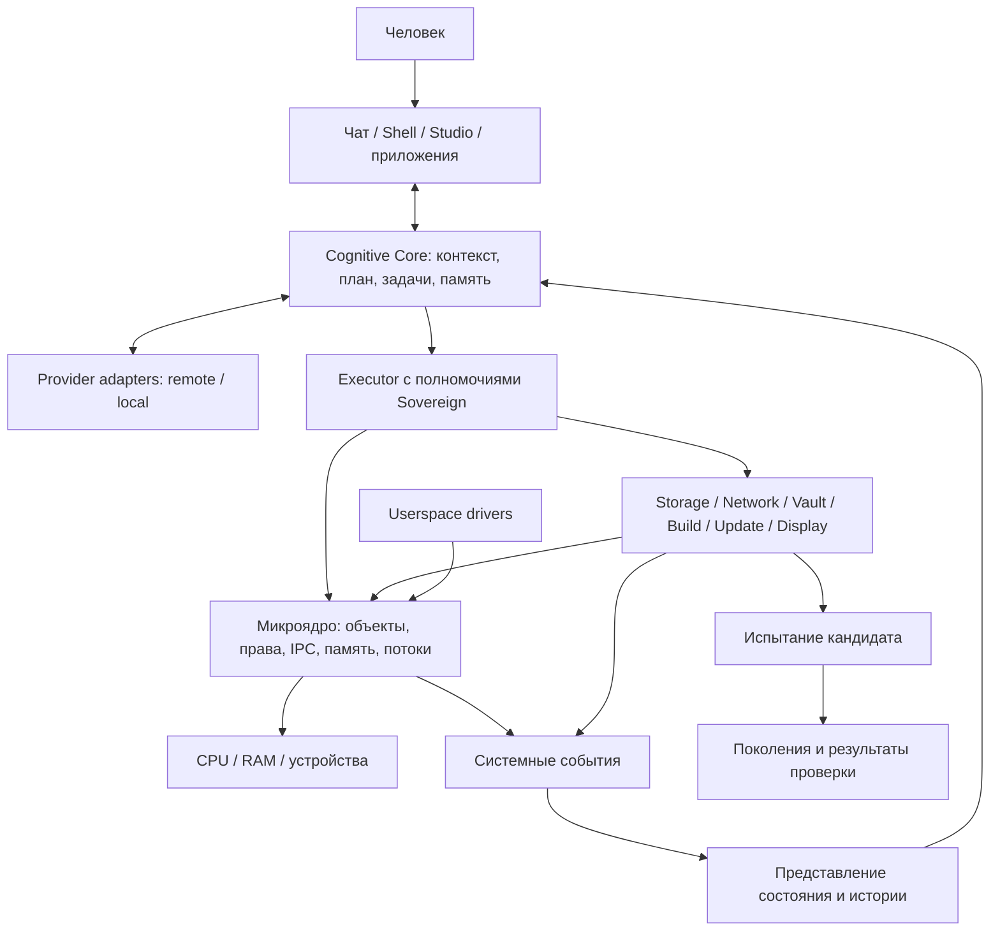

# NANOX-OS: целевая архитектура

Статус: проектное решение, реализация начинается с M0. Технологический baseline задан в [ADR-0001](adr/0001-platform.md). Этот документ описывает всю систему; наличие раздела не означает готовность компонента.

## 1. Назначение и конечный результат

Человек управляет машиной через постоянный чат и собственные приложения. Cognitive Core получает актуальное состояние ОС, обладает полными системными правами и исполняет задачи с проверкой результата. ОС хранит собственные исходники, собирает кандидаты обновлений, испытывает их и устанавливает рабочие поколения.

Зрелая демонстрация: пользователь сообщает об ошибке компонента; Core связывает её с наблюдениями и ревизией, воспроизводит, изменяет код, строит и проверяет кандидат, устанавливает его и подтверждает исправление. Неуспешный кандидат восстанавливается предусмотренным механизмом.

Обязательная основа: своё ядро, системные интерфейсы, Core, хранилище, сеть, VPN, управление ключами, shell и Studio. Собственная ISA, обучение базовой модели и собственный компилятор не являются условиями первой загрузки.

## 2. Слои

Ядро не зависит от модели, provider API, файлового формата IDE или графовой базы. Core не вызывается на каждом прерывании, page fault или переключении потока.

## 3. Ядро

### Обязанности

- CPU state, exceptions, IRQ dispatch, timers и monotonic clock.
- Физическая память, page tables, адресные пространства, отображения.
- Потоки, вытесняющий scheduler, состояния блокировки и завершения.
- Kernel objects, handles, права и управление временем жизни.
- IPC request/reply, notifications, ожидание и отмена.
- Выделение/отображение MMIO, доставка IRQ и механизмы DMA.
- Bootstrap authority и привилегированные механизмы контроля машины.
- Минимальный serial/panic/trace путь для диагностики.

Первая реализация однопроцессорная. Это не устраняет конкурентность: прерывания и вытеснение всё равно создают критические секции. Правила lock ordering, отключения IRQ и запрета блокирующего ожидания под spinlock документируются при появлении соответствующего механизма.

### Что находится вне ядра

Файловая система, сеть, криптографические протоколы, policy приложений, package manager, compositor, компилятор, LLM и его планировщик — отдельные сервисы. Boot serial и ранняя платформенная инициализация остаются осознанными исключениями.

Повторный запуск драйвера требует не только нового процесса, но и восстановления устройства, завершения/отмены outstanding requests и освобождения DMA buffers. Нельзя обещать это для любого устройства без соответствующего протокола.

## 4. Полномочия и доверие

### Bootstrap

1. Ядро создаёт первый userspace process `init` и начальную authority над объектами системы.
2. `init` запускает сервисы и выдаёт им минимальные необходимые handles.
3. `init` запускает Cognitive executor и передаёт ему Sovereign authority.
4. Сам Core может менять права, сервисы, конфигурацию, исходники и работающий системный код через предусмотренные привилегированные механизмы.

Root не возникает из строки конфигурации или поля сообщения. Предъявление обычного числа, имени процесса или JSON с `role=root` не создаёт authority.

### Смысл Sovereign

Это полный контроль над программно доступными ресурсами NANOX, включая возможность изменять проверки и сам исполнитель. Штатные действия идут через NCI; низкоуровневые операции также доступны. Отдельный режим «разрешить ИИ работать только в проектной папке» не подменяет это требование.

При этом идентичность Core защищается от обычных приложений. Их права проверяются ядром и владельцами объектов; чужой сайт, документ или лог не становится субъектом управления.

Высокий уровень полномочий не создаёт отсутствующую аппаратную функцию. Root не заменяет драйвер, не делает закрытую прошивку доступной и не отменяет физические свойства устройства.

### Надёжность при полном root

Снимки, журналы и тесты — штатный способ работы. Core может их отключить. Поэтому внутри одной области контроля нельзя гарантировать сохранность аудита или резервной копии от самого Sovereign.

Подпись артефакта подтверждает происхождение относительно ключа, а не корректность программы. Полноценный защищённый boot на физической машине требует отдельной цепочки доверия, выбора ключей владельца и процедуры восстановления. В M0 подпись не имитируется.

Доверенная база для поведения всей ОС шире микроядра: в неё входят загрузка, init, исполнитель, логика выбора действий и используемые решения модели. Локальный executor не исключает влияние удалённой модели на привилегированные действия.

## 5. Объекты, права и IPC

Начальные kernel types: `AddressSpace`, `Thread`, `MemoryObject`, `Endpoint`, `Notification`, `Irq`, `DeviceRegion`, `Authority`.

Handle — локальная ссылка из таблицы процесса с маской прав. Передача через IPC создаёт запись в таблице получателя. Ограниченные права нельзя повысить обычным duplicate; отдельная Sovereign authority позволяет выполнять системное управление. Это согласуется с идеей объектных handles, описанной в [Zircon](https://fuchsia.dev/fuchsia-src/concepts/kernel/handles), без копирования его ABI.

Идентификаторы объектов для телеметрии не являются полномочиями. Они содержат boot epoch и поколение, чтобы старая задача ИИ не действовала на переиспользованный номер.

Синхронный IPC ограничивает размер сообщения и число передаваемых handles, имеет deadline, ошибки смерти peer и семантику отмены. Большие данные передаются MemoryObject; shared rings добавляются после измерения необходимости. Для них требуются memory ordering, ownership и backpressure.

Приложение не передаёт ядру произвольный граф объектов. Ядро принимает проверенные дескрипторы и копирует управляющие данные до совершения эффекта. Память shared buffers не считается неизменной без отдельного механизма.

## 6. Состояние и история

| Сущность | Владелец фактического состояния |
| --- | --- |
| Thread, mapping, handle | Ядро |
| File/ObjectVersion | Storage service |
| Connection/Tunnel | Network service |
| KeyHandle | Vault |
| BuildArtifact | Build service |
| Generation | Update service и boot manifest |
| Action/Attempt | Task engine и executor |
| Observation | Источник телеметрии |
| Hypothesis/Summary | Core; всегда интерпретация |

Граф состояния — индекс и производное представление. Перед мутацией проверяется ревизия у владельца. Для нескольких сервисов нет автоматически атомарного «снимка всего»: нужна согласованная точка или явно описанная несогласованность наблюдений.

Событие включает источник, локальный sequence, boot ID, ссылку на объект и, если известно, parent action. Потери событий и переполнение очереди регистрируются; потребитель пересчитывает состояние через snapshot. Строгий глобальный порядок и полная причинность не выводятся из timestamps.

Историческая память ИИ хранит источник, версию, актуальность и степень подтверждения. Предположение о причине сбоя не записывается как подтверждённый факт.

## 7. Cognitive Core

### Компоненты

| Компонент | Обязанность |
| --- | --- |
| Provider adapter | Преобразование запроса в конкретный API/локальный runtime, streaming, отмена, ошибки |
| Context service | Получение актуальных наблюдений и релевантных исходников |
| Planner | План действий с зависимостями и ожидаемыми результатами |
| Task engine | Состояния, попытки, deadline, возобновление после сбоя |
| Executor | Реальные NCI/системные действия с Sovereign authority |
| Verifier | Наблюдаемая проверка результата |
| Memory | Ссылки на факты, решения, источники и историю задач |

Первый вариант может объединять несколько логических модулей в одном userspace процессе. Их интерфейсы сохраняются; создавать распределённую систему из десятка процессов ради названий не нужно.

### Выполнение

`CREATED → OBSERVING → PLANNED → RUNNING → VERIFYING → SUCCEEDED`.

Ошибочные исходы: `FAILED`, `CANCELLED`, `OUTCOME_UNKNOWN`. Компенсация — новое действие, не стирание истории. Задержка или потеря ответа не дают права безусловно повторить необратимую операцию.

Управление результатом принадлежит task engine. Провайдер может сообщить о tool call, но факт выполнения подтверждает executor и затем наблюдение владельца ресурса.

### Модельный интерфейс

Основной контракт: capabilities провайдера, сообщения/контекст, schemas инструментов, события streaming, tool-call proposals, usage, finish reason, cancel и typed errors. Поддержка каждой возможности определяется адаптером.

OpenAI-compatible transport — один адаптер. Реальная поддержка tools, JSON schemas, параллельных вызовов и отмены тестируется для выбранного endpoint. Имя модели, URL и способ аутентификации — конфигурация, не часть ABI ядра.

В M3 host bridge общается с guest через COM2. Он выполняет запросы к модели, но системные действия происходят в guest. Его доступ не расширяется автоматически до управления host. При replay используются записанные входы; повторный запрос внешней модели не является воспроизведением.

### Готовность и сбои

Boot phases: firmware → loader → kernel → init/services → cognitive ready. Отказ provider переводит интерфейс в degraded state. Scheduler, хранилище и recovery shell продолжают работать. Core можно перезапустить и восстановить его задачи.

## 8. Хранилище и пакеты

Порядок: initramfs/RAM store → virtio-blk → собственный transactional object store → namespaces и файловый API.

Постоянная идентичность объекта отделена от хеша версии. Имена файлов — индекс к объектам. Данные и метаданные версионируются; старые поколения удерживают необходимые ссылки.

Дисковый формат определяет superblocks, checksums, commit protocol, ordering/flush, recovery, GC и поведение при заполнении диска. Требуются fault injection и повреждённые fixtures. История не считается durable после одного вызова записи без подтверждённого протокола.

Пакет содержит manifest, ABI requirements, архитектуру, хеши payload, зависимости и происхождение. Установка создаёт новое системное поколение. Непроверенный пакет не наделяет себя правами одной записью `capabilities` в manifest.

Системные поколения и пользовательские данные разделены. История хранилища дополняет Git; совместная разработка и слияния не заменяются самими snapshots.

## 9. Обновления и разработка самой ОС

Кандидат связывает source snapshot, toolchain, build artifacts, тесты и версии схем. Штатный путь: prepare → build → test → publish generation → trial boot → accept/rollback.

Bootloader читает manifest выбранного поколения и последнего подтверждённого. Trial attempt фиксируется до запуска кандидата. Внешний QEMU harness сначала обеспечивает timeout/reset; на bare metal для зависания необходим отдельно проверенный watchdog.

Boot success недостаточен для принятия сложного обновления: health criteria включают необходимые сервисы и миграции. Форматы пользовательских данных либо остаются обратно совместимыми, либо имеют подготовленный snapshot/путь восстановления. Откат бинарника не откатывает внешние эффекты и не гарантирует совместимость новых данных.

Первая замена kernel — через reboot. Позже userspace сервис может обновляться через drain → checkpoint → migrate → restart. Произвольный hot patch kernel не входит в baseline.

До self-hosting Build/Test service вызывает явно обозначенный host builder. Это считается удалённой сборкой собственной ОС, а не нативным компилятором NANOX. Полное self-hosting включает порт toolchain, библиотеки, процессы, файловые интерфейсы и испытательную среду.

## 10. Сеть, VPN и криптография

Network service: virtio-net → Ethernet/ARP → IPv4/ICMP/UDP → TCP/DNS → TLS → native remote provider. IPv6, сложная маршрутизация и производительность вводятся отдельными проверяемыми шагами.

NANOX Tunnel — сервис управления стандартным VPN-транспортом. Первая цель — совместимость с WireGuard. Собственное имя сервиса не означает изобретение нового криптографического протокола.

Vault отвечает за entropy, CSPRNG, генерацию, использование, ротацию и recovery ключей. Конкретные примитивы, протоколы и on-disk encryption оформляются отдельной спецификацией перед реализацией. Изменение счётчиков/nonce при reboot и rollback проверяется специально.

Собственные реализации криптографии допускаются после известных test vectors, differential tests и проверки корректности использования. До этого использовать только тестовые секреты и не заявлять защищённое хранение. Запрет сторонних crates в ядре не является аргументом изобретать новый шифр.

Ключи отделены по назначению; резервное копирование должно сохранять их восстанавливаемость. Неэкспортируемый hardware key и право выполнить операцию этим ключом — разные возможности. Vault защищает от обычных приложений, но не обещает скрыть доступный ОС открытый секрет от Sovereign.

## 11. UI, приложения и Studio

Каждое собственное приложение предоставляет visual view, semantic tree и типизированные actions. Устойчивые IDs, ревизии документа и состояния фокуса позволяют управлять им без угадывания координат.

Начальные приложения: recovery shell, чат, файловый интерфейс, настройки, network/VPN manager, просмотр событий. Studio добавляет редактор, проектную структуру, диагностику, build/test панели, задачи ИИ и сравнение поколений.

Рендерер сначала программный: framebuffer, ввод, glyph cache, Unicode/text layout, compositor. GPU compute требует другого стека и не появляется вместе с окнами. Терминал, clipboard и доступность UI имеют собственные контракты.

Произвольная совместимость с POSIX/Windows приложениями — отдельные compatibility services или гостевые среды; она не навязывает их ABI ядру NANOX.

## 12. Железо и локальный интеллект

Первый физический порт ограничен заранее выбранной конфигурацией. Требуются ACPI/PCI, interrupts, таймеры, storage/network/input и power management по фактическим устройствам. Перечень поддержки ведётся по device IDs и версиям firmware.

Userspace driver с DMA может влиять на чужую память без аппаратной защиты. IOMMU, buffer pinning, cache coherence и reset устройства проектируются до обещания изоляции недоверенных DMA drivers.

Локальная модель сначала CPU: выбранные веса и tokenizer, ограниченный набор операторов, quantization, reference outputs, измерение RAM и latency. GPU backend добавляется для конкретного устройства и набора операторов. Обучение собственной большой модели — отдельный ресурсный проект.

## 13. Исследовательская ветка

- **Semantic IR:** ограниченная семантика типов и эффектов, эталонный interpreter, CPU/SIMD backend, затем GPU. Cache identity включает версии IR, compiler и target features.
- **Проверяемые свойства:** права, состояния обновления, lifetime handles и ограниченные IR-преобразования. Каждое доказательство привязано к версии и предпосылкам.
- **Record/replay runtime:** контролируемый класс задач, запись входов, версии моделей и внешних результатов. Не универсальное обращение физических эффектов.
- **Планирование графа:** runtime знает зависимости и подаёт scheduler hints; оценка против базового планировщика на одинаковых workloads.
- **Испытательная модель системы:** фиксированный guest state и replay сценарии, с явным отличием от реального оборудования.
- **Свой язык/ISA/compiler:** после установленной потребности; расширение формата ради имени не считается исследовательским результатом.

## 14. Что означает успех

Успех — воспроизводимые действия внутри собственной ОС и прослеживаемое изменение её поведения. Измеряются completion rate задач, восстановление после сбоев, boot stability, накладные расходы, полнота наблюдений и степень независимости от host.

Полная система — многолетняя программа для небольшой команды. Конкретный календарь определяется после M0–M3 и измерения темпа. Максимальная версия не ограничивается ранним стендом, но каждый следующий уровень опирается на проверенный предыдущий.
