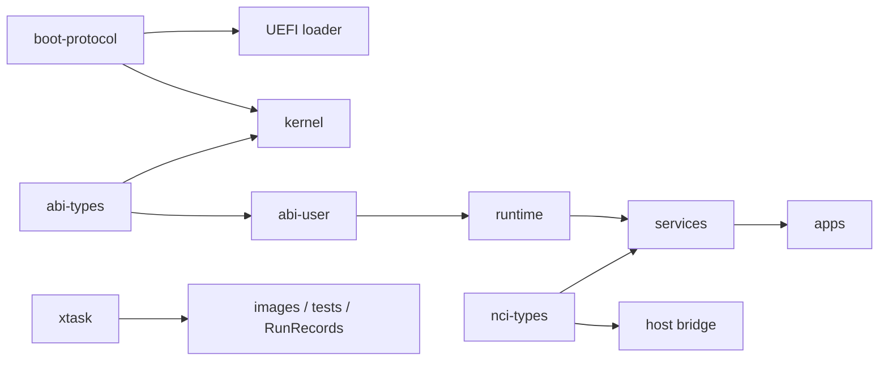

# Карта проекта и границы модулей

Карта целевая. Каталоги исходников создаются по этапам, а не все сразу.

Реализовано в M0 (фактическое состояние — [STATUS](STATUS.md)): `flake.nix`,
`flake.lock`, `rust-toolchain.toml`, workspace `Cargo.toml`/`Cargo.lock`,
`.cargo/config.toml`; `boot/uefi/` (`main.rs`, `uefi.rs`, `memory.rs`,
`serial.rs`, `transition.rs`, `transition.S`); `kernel/` (`main.rs`,
`linker.ld`); `crates/boot-protocol/` с host-тестами; `tools/xtask/`
(`main.rs`, `build.rs`, `image.rs`, `runner.rs`, `record.rs`);
`tools/qemu/replay-exit-code.patch`; `tests/fixtures/`. Срез M5-1:
`crates/net-wire` (кодеки Ethernet/ARP/IPv4/ICMP/UDP, контракт
[M5-NETWORK](specs/M5-NETWORK.md)). Фактическое деление
M0-модулей уже, чем в дереве ниже: например, ELF parser находится в
`crates/boot-protocol/src/elf.rs`, а не в `boot/uefi`. Остальные модули дерева
(в том числе `kernel/src/{arch,mm,task,object,ipc,device,control,debug}`,
прочие crates, `abi/`, `services/`) ещё не реализованы.

## 1. Будущее дерево

```text
NANOX-OS/
├── AGENTS.md, CLAUDE.md, README.md
├── flake.nix, flake.lock, rust-toolchain.toml
├── Cargo.toml, Cargo.lock
├── .cargo/config.toml
├── boot/uefi/
│   ├── Cargo.toml
│   └── src/{main.rs,efi.rs,elf.rs,memory.rs,paging.rs,handoff.rs,serial.rs}
├── kernel/
│   ├── Cargo.toml, linker.ld
│   └── src/
│       ├── main.rs
│       ├── arch/x86_64/{entry.S,gdt.rs,idt.rs,interrupts.S,context.S,syscall.S,ports.rs,apic.rs}
│       ├── mm/{physical.rs,virtual.rs,heap.rs,mapping.rs}
│       ├── task/{thread.rs,scheduler.rs,wait.rs}
│       ├── object/{table.rs,handle.rs,rights.rs,authority.rs,lifetime.rs}
│       ├── ipc/{endpoint.rs,message.rs,reply.rs,notification.rs}
│       ├── device/{region.rs,irq.rs,dma.rs}
│       ├── control/{dispatch.rs,inspect.rs,privileged.rs}
│       └── debug/{serial.rs,panic.rs,trace.rs,test_exit.rs}
├── crates/
│   ├── boot-protocol/
│   ├── abi-types/
│   ├── abi-user/
│   ├── nci-types/
│   ├── runtime/
│   ├── elf-format/
│   └── crypto/
├── abi/{syscalls.toml,objects.toml,nci/}
├── services/
│   ├── init/
│   ├── cognitive/
│   │   └── src/{provider.rs,context.rs,planner.rs,task.rs,executor.rs,verify.rs,memory.rs}
│   ├── event-store/
│   ├── object-store/
│   ├── network/
│   ├── tunnel/
│   ├── vault/
│   ├── build/
│   ├── update/
│   ├── packages/
│   ├── display/
│   └── inference/
├── drivers/{virtio-blk,virtio-net,virtio-input,display,pci}/
├── apps/{shell,chat,files,settings,studio}/
├── tools/
│   ├── xtask/
│   ├── abi-gen/
│   ├── bridge/
│   ├── image/
│   └── inspect/
├── tests/{host,fixtures,qemu,conformance,faults,scenarios}/
├── research/{ir,replay,scheduling,verification,compiler}/
├── docs/{adr,specs}/
└── out/{artifacts,runs,images}/       # генерируется, не хранится в Git
```

На ранних этапах `tools/image` может быть модулем `xtask`, а `elf-format` — общим проверяемым модулем loader. Выделять crate следует при реальной границе повторного использования.

## 2. Контракты и доказательства готовности

| Компонент | Вход → выход | Зависимости | Главная проверка |
| --- | --- | --- | --- |
| xtask | checkout/profile → образ/RunRecord | Host toolchain | Новый checkout, timeout и неверный exit |
| UEFI loader | firmware + ELF → BootInfo/entry | Только свои guest crates + sysroot | Повреждённый ELF не запускается |
| Boot protocol | Поля handoff → читаемое ядром состояние | core | Layout assertions и несовместимая версия |
| Physical MM | Карта памяти → frames | BootInfo | Нельзя выдать reserved/free twice |
| Virtual MM | Object/range → mappings | Physical MM, CPU paging | Нет доступа за пределами разрешения |
| Scheduler | Runnable/waits → выполняемый thread | Timer, context | Вытеснение и корректное пробуждение |
| Object table | Handle/op → объект или error | Lifetime, rights | Stale handle и повышение прав |
| IPC | Запрос/handles → reply/timeout | Scheduler, object table | Peer death, cancellation, malformed payload |
| init | Bootstrap authority → процессы/права | ELF loader userspace, IPC | Выданные права соответствуют плану |
| Cognitive Core | Намерение/observations → действия/итог | NCI, provider | Фактическое действие и проверка результата |
| Event service | События → индекс/история | IPC, затем storage | Пропуск sequence и resync |
| Object store | Мутация → durable version | Block driver | Power-loss cutpoints, corruption, full disk |
| Network | Frames/requests → connections | Net driver, timers | Потери, reorder, limits и interoperability |
| Vault | Key operation → result/handle | Entropy, crypto, storage | Известные vectors, nonce/reboot policy |
| Tunnel | Profile/packets → tunnel | Network, Vault | Независимый peer, replay protection |
| Build | Source snapshot → artifacts | Storage, builder adapter | Source/artifact provenance |
| Update | Candidate → trial/active generation | Boot manifest, store, tests | Неудачная загрузка и миграция |
| Display | Surfaces/input → desktop | Framebuffer/input drivers | Lifetime surface, isolation, input focus |
| Studio | Проект/задачи → рабочий сценарий | Editor, Core, Build, Update | Дифф → тест → образ → наблюдение |
| Inference | Tokens/weights → model output | Runtime, memory, operators | CPU reference, RAM/latency |

## 3. Направление зависимостей



Стрелка здесь означает «поставляет контракт/возможности потребителю», а не runtime-вызов. Kernel не зависит от apps, provider SDK, host crates или full NCI JSON parser.

`abi-gen` работает на host и порождает проверяемые типы/dispatch metadata. Guest не запускает генератор при boot. Сгенерированные файлы должны соответствовать schema hash; ручные копии числовых ID не размножаются по компонентам.

Host unit tests могут собирать чистые guest модули для host target. Это не добавляет `std` в guest binary. Dependency graph проверяется отдельно для каждого target.

## 4. Владение памятью и ресурсами

- Loader владеет UEFI allocations до handoff. После него BootInfo перечисляет переданные и зарезервированные области; ядро решает, что и когда освобождать.
- Ядро владеет kernel objects и validates handles. Userspace владеет содержимым своих MemoryObject, кроме явно shared областей.
- Driver получает ограниченные MMIO/IRQ/DMA resources. Pinning DMA держится до завершения или проверенного reset, не только до смерти процесса.
- IPC transfer в базовом варианте передаёт копию handle с подмножеством прав. Более сложный move-transfer вводится только с определённой точкой commit и rollback.
- Большой shared buffer имеет владельца протокола, состояния заполнения и ограничения времени жизни.
- Live object ID, storage object ID, content hash, handle и request ID — разные типы. Не использовать один UUID для всех понятий.

## 5. Артефакты и имена

| Имя | Значение |
| --- | --- |
| SourceSnapshot | Исходная ревизия плюс точные изменения/manifest файлов |
| BuildArtifact | `.efi`, `.elf`, initramfs, пакет; immutable payload и hash |
| RunRecord | Один запуск проверки, входные артефакты, окружение и результат |
| ReplayTrace | Запись недетерминированных входов конкретного QEMU-профиля |
| Generation | Согласованный набор компонентов и схем для загрузки/установки |
| Action | Намеренная системная операция с request ID |
| Attempt | Одна попытка Action с отдельным состоянием выполнения |
| Observation | Факт от владельца ресурса или телеметрии |
| Hypothesis | Объяснение, которое ещё нужно проверять |

M0 создаёт RunRecord и набор build artifacts. Полный жизненный цикл Generation появляется в M6; ранний отчёт запуска не выдаётся за работающий менеджер поколений.

## 6. Будущие спецификации по моменту появления

| Перед этапом | Что уточнить и добавить |
| --- | --- |
| M1 | Memory map layout, exceptions, timer source, lock ordering |
| M2 | Точные syscall IDs/signatures, IPC state machine, process startup, handle lifetime |
| M3 | Framing COM2, provider contract, action state machine, event loss/resync |
| M4 | Дисковый layout, commit/flush/recovery, GC, quotas |
| M5 | Network state machines, entropy, crypto suite, TLS trust/time, secret storage |
| M6 | Generation manifest, trial boot, watchdog, data migration |
| M7 | UI semantic tree, document revisions, package installation, tunnel interoperability |
| M8 | Формат выбранных весов, tokenizer, tensor semantics и CPU backend |
| M9 | Аппаратный profile, SMP, DMA/IOMMU и device reset |
| M10 | Native target ABI/libc/std strategy, toolchain port, VMM/emulator |

Такое уточнение не переоткрывает общую архитектуру. Оно превращает следующий модуль в проверяемый контракт тогда, когда известны его зависимости.
